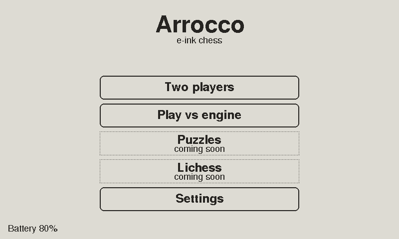
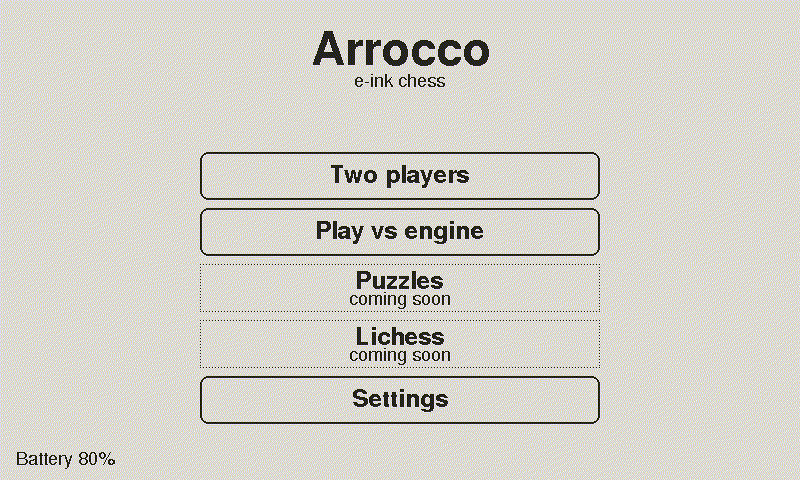
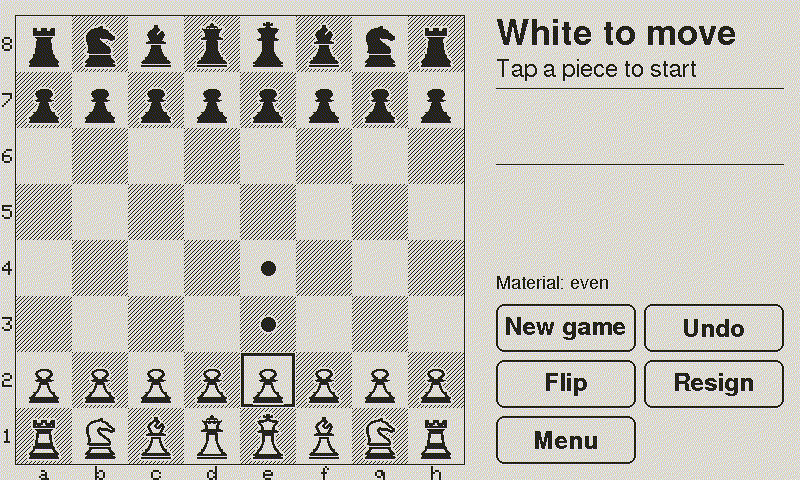
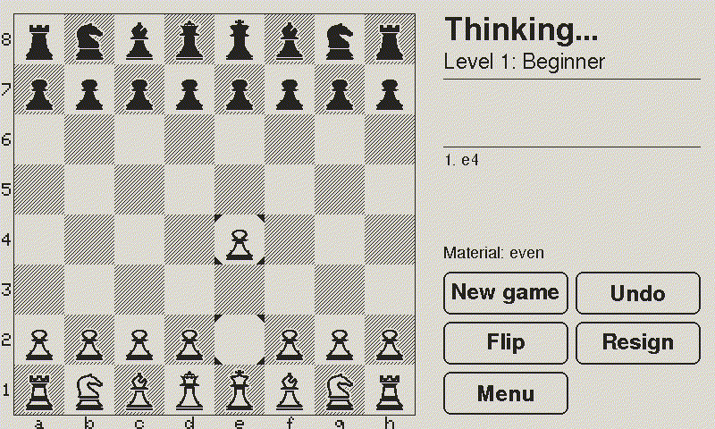
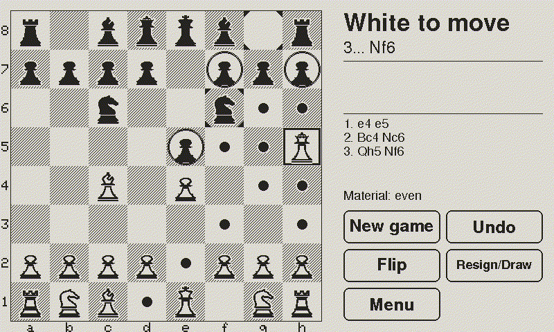
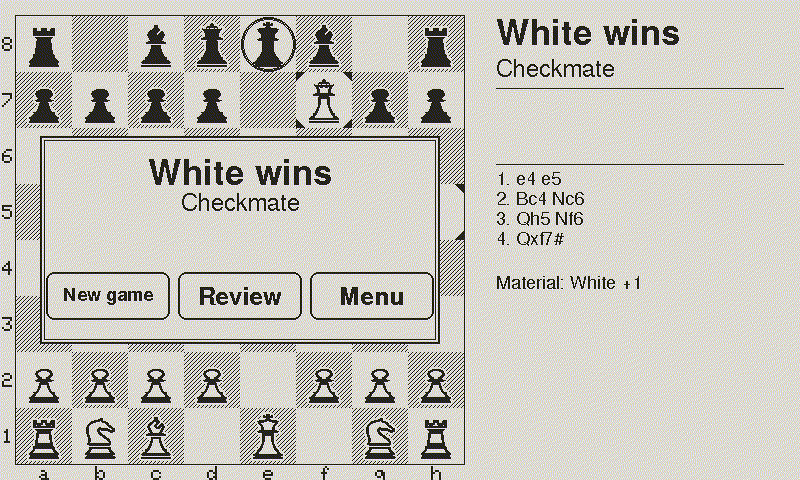
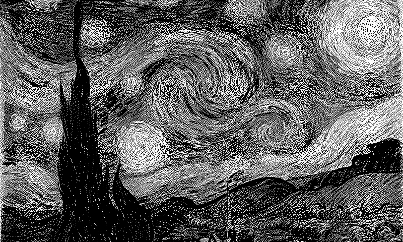

# Arrocco — e-ink chess

<p align="center">
  
</p>

An open e-ink touch chessboard by CollectiCraft: a 7.5" e-paper panel with a touch layer, an ESP32-S3 and a battery, in a thin 3D-printed case that lies flat on the table. Play the built-in engine, play a friend on the same board, solve puzzles offline, or play on Lichess over Wi-Fi.

Arrocco is an open alternative to commercial e-ink chessboards. It is not affiliated with any commercial e-ink chessboard.

## Video

https://github.com/user-attachments/assets/46ad5615-c2e3-4168-b6a4-794eb43ac288

24 seconds: the parts it is made of, then a game to checkmate on the real firmware screens (captured from the simulator).
A non-commercial project video. Music: "AURA" by Ogryzek, which belongs to its rights holders. Photos: Unsplash (Sasun Bughdaryan, Alexandre Debiève, Jakub Żerdzicki). Fonts: Instrument Serif and Unbounded (SIL Open Font License).

## The screens

| | |
|---|---|
|  |  |
| **The menu.** Two players, the engine, puzzles and Lichess. | **Tap a piece:** a frame, and a dot on every legal move, in one refresh. |
|  |  |
| **The engine answers.** CT800 runs on the board itself, eight levels from Beginner to Expert. | **Captures are ringed**, quiet moves dotted. |
|  |  |
| **Checkmate**, with the move list in the side column. | **Asleep.** Van Gogh's *Starry Night* when no game is on; mid-game the position stays on the glass, and a tap wakes the board straight back into it. |

Every screen here is the real firmware, captured from the Mac simulator, which runs the same code and draws the same 800 × 480 pixels as the board. The pieces are the CollectiCraft set, drawn for this board.

## Status: first device running

The first board was assembled and brought up on 6 October 2026. On the real hardware:

- the panel works (full refresh 1.6 s, partial 0.4 s) and shows clean solid black and white;
- the touch works (GT911, axes right without any correction) and the buzzer sounds;
- the real firmware runs: menu, two players on the same board, and the CT800 engine;
- it runs on the LiPo, switched by the driver board's power switch;
- it sleeps after five minutes untouched and wakes on a tap, with the radio off unless something needs it;
- a game survives a power cut: it is saved after every move and offered again as "Resume game".

Bring-up procedure and measured results: [docs/collaudo.md](docs/collaudo.md). Next: the puzzle and Lichess screens, the case.

## Hardware

| Part | Notes |
|---|---|
| Good Display GDEY075T7-T01 | 7.5" e-paper, 800 × 480, UC8179 controller, GT911 touch |
| Seeed ePaper Driver Board for XIAO (114993558) | display connector, LiPo charger, power switch |
| Seeed XIAO ESP32-S3 Plus, pre-soldered headers | 16 MB flash, 8 MB PSRAM |
| LiPo 606090, 4000 mAh, JST PH 2.0 | check polarity with a multimeter before plugging in |
| MAX17048 fuel gauge breakout | battery percentage, on the touch I2C bus |
| KY-006 passive buzzer | optional |
| 6-pin 0.5 mm FPC breakout + two 4.7 kΩ resistors | touch connection inside the case |
| Good Display ESP32-FTS02 | bench only, as a touch adapter; too tall for the case |
| Two 1 × 7 pin headers, 2.54 mm | soldered into the driver board's CN1/CN2 holes |

Through-hole soldering only. Wiring and pin map: [docs/wiring.md](docs/wiring.md). Shopping list: [docs/da-comprare.md](docs/da-comprare.md). Bring-up procedure: [docs/collaudo.md](docs/collaudo.md).

## Repository layout

| Path | What it is |
|---|---|
| `lib/arrocco/` | Portable core: chess rules and user interface. The same code runs on the device and on a Mac. |
| `src/hwtest/` | Hardware-validation firmware. It checks the display, the touch and the wiring by itself and reports on the screen. |
| `src/app/` | The device firmware: menu and games, the CT800 engine task, Wi-Fi and the Lichess client. |
| `sim/` | Mac simulator. Run `sim/run.sh`. |
| `test/chess/` | Native tests for the rules library. Run `make -C test/chess test`. |
| `assets/pieces/` | SVG sources for the CollectiCraft 1-bit piece set, with a template. |
| `docs/` | Working notes, mostly in Italian. [docs/decisioni.md](docs/decisioni.md) is the source of truth for project decisions. |

## Build and run

The firmware builds with [PlatformIO](https://platformio.org/):

```sh
pio run -e hwtest             # build the hardware-validation firmware
pio run -e hwtest -t upload   # flash it over USB-C
pio device monitor            # read its log
```

The tests need only a C++17 compiler. The simulator also needs Python 3 (no packages) and the Adafruit GFX sources that PlatformIO downloads during the first firmware build, so build the firmware once before running it:

```sh
make -C test/chess test     # rules library tests (perft)
make -C test/savegame test  # the saved game: round trips, and every corrupt blob refused
sim/run.sh                  # build, start the local server, open the page
```

A game in progress survives a power cut: the board keeps it in flash and offers "Resume game" at the next start. The simulator keeps its flash in `sim/build/state`, so "Restart app" on the page is the same as pulling the cable. Delete that folder, or start with `sim/run.sh --no-state`, for a board fresh from the factory.

## Roadmap

1. **Hardware validation.** Done on the first device (6 October 2026): the `hwtest` firmware finds wiring faults by itself and names them on the screen.
2. **Rules library.** Done; everything else builds on it.
3. **Interface and two players** on the same board, with a clock. One screen refresh per event, few full-screen flashes.
4. **Engine.** CT800 in its own task, speaking UCI. Named levels, from easy ones below 1000 Elo up to club strength.
5. **Offline puzzles** from the Lichess puzzle database, stored in flash.
6. **Lichess.** Login by QR code (OAuth PKCE), pasted token as a fallback. Play Lichess Stockfish, challenge a friend, accept invites. Casual games by default, rated on request.
7. **Later:** take back, hints.
8. **Release.** Tagged versions built by CI, with a browser flasher on GitHub Pages. No secure boot and no flash encryption: you can always install your own build.

The CollectiCraft piece set is drawn by hand ([guide, in Italian](docs/pezzi.md)); until it is ready the firmware draws a placeholder set. The interface is English only.

## The case

The 3D-printed case is published separately on MakerWorld and is not in this repository. This repository holds the firmware, the wiring and the measurements.

## Licence

GPL-3.0-or-later, see [COPYING](COPYING). The display library, GxEPD2, is GPL-3.0, so the firmware already has to be; the planned chess engine is GPL-3.0-or-later as well. Third-party components are listed in [THIRD-PARTY.md](THIRD-PARTY.md).
