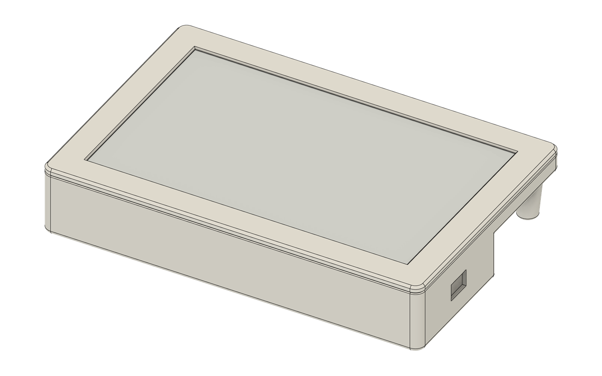
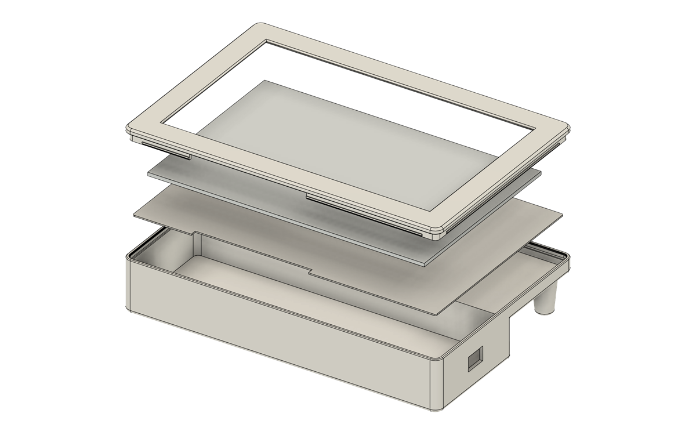
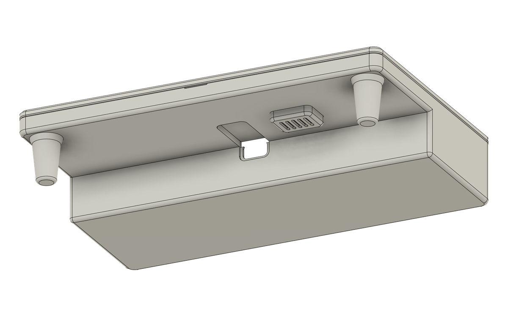
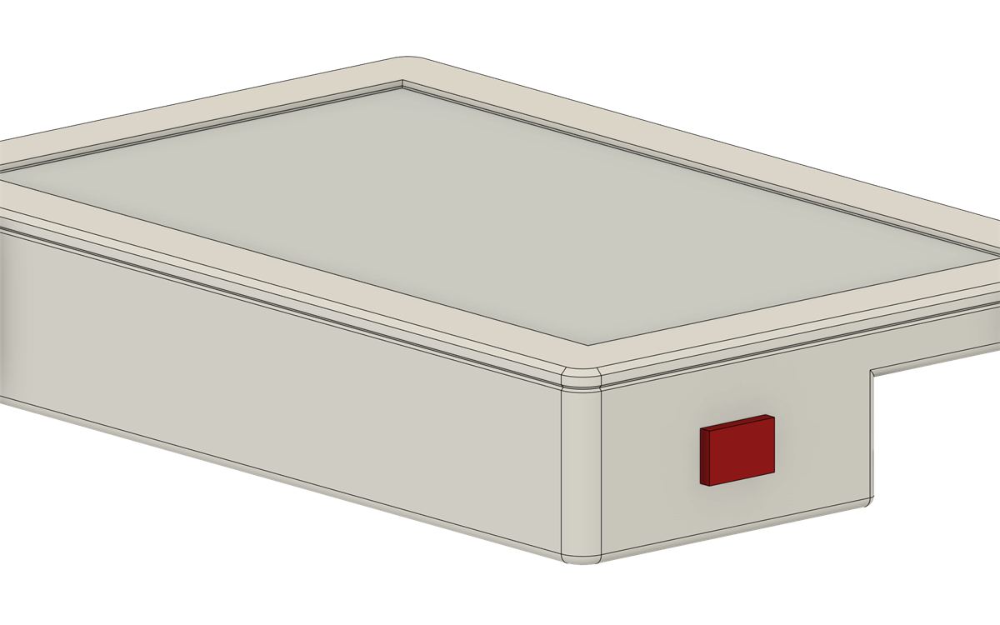
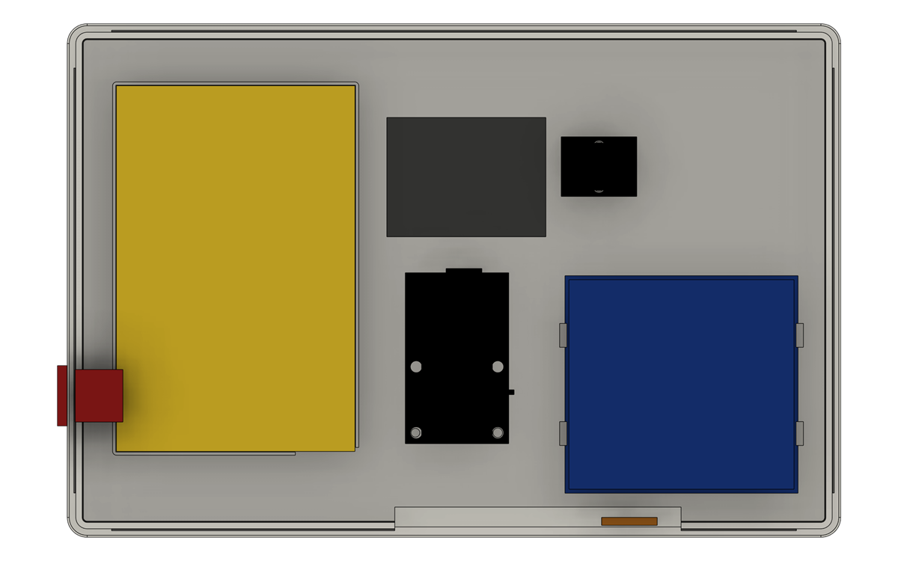

# Scocca — misure per partire

> **8 ottobre 2026: la scocca è finita e stampata.** Le sezioni 1–6 sono le misure di partenza del 22 settembre. Dove dicono una cosa diversa sono superate: la scocca vera, con le misure prese col calibro, è nel [§7](#7-la-scocca-finale-8-ottobre-2026).

Aggiornato il 22 settembre 2026. I pezzi non sono ancora arrivati.

Questo documento serve a impostare il modello **prima** dell'hardware. È diviso in due:

- **Misure certe** — prese dai disegni dei costruttori (Good Display, Seeed). Su queste puoi costruire.
- **Da misurare col calibro** — segnate ⚠️. Non fidarti, e soprattutto **non chiudere il modello** finché non le hai verificate.

La scocca non entra in questo repo: va su MakerWorld come Exclusive. Qui ci stanno solo le misure.

---

## 1. Impianto scelto

Orizzontale da tavolo, con un **mento** sotto il display per l'elettronica. Il motivo è lo spessore: la driver board col XIAO montato è alta 12–15 mm, mentre dietro il pannello basta fare spazio alla batteria da 6 mm. Mettendo la scheda di fianco invece che dietro, il corpo resta sottile e la USB-C esce naturale dal bordo.

```
            170,2                    vista da davanti
  ┌──────────────────────────────┐
  │  ╔════════════════════════╗  │   cornice
  │  ║                        ║  │
  │  ║    area attiva         ║  │   111,2   il flat esce dal
  │  ║    163,2 × 97,92       ║  │          lato lungo in basso
  │  ║                        ║  │
  │  ╚════════════════════════╝  │
  ├──────────────────────────────┤
  │   mento: driver board, ~30   │   ← USB-C e interruttore su questo bordo
  └──────────────────────────────┘

                                     vista di lato
     ┌───────────────────────────┐   pannello 2,13
     │▓▓▓▓▓▓▓▓▓▓▓▓▓▓▓▓▓▓▓▓▓▓▓▓▓▓▓│
     │        batteria 6,0       │   dietro il pannello: ~11 col guscio
     └───────────────┬───────────┘
                     │ driver board 12–15  ← è questa che detta lo spessore
                     └───────────────────
```

Spessore totale realistico: **15–16 mm**, ma solo se la driver board sta nel mento. Dietro il pannello sarebbero 18–20.

---

## 2. Pannello — misure certe

Fonte: scheda tecnica GDEY075T7-T01 e disegno TP075-Y01.

| Cosa | mm |
|---|---|
| Vetro (L × A × S) | 170,20 × 111,20 × 2,13 |
| Area attiva (quello che si vede) | 163,20 × 97,92 |
| Area utile del touch | 164,20 × 98,92 |
| Altezza sagoma del sensore touch | 109,21 ±0,2 |
| Peso | 65 ±0,5 g |

**Apertura della cornice**: fra 163,2 (area attiva) e 164,2 (area touch). Consiglio **164,5 × 99,2**, così non copri punti sensibili al tocco e il margine di stampa non mangia pixel. Se stringi sotto 163,2 tagli immagine.

**Superficie**: non c'è vetro di copertura separato. Sopra c'è solo il sensore (0,48) più la pellicola antiriflesso (0,15), incollati a pieno. Durezza 6H o meglio. Vuol dire che **la cornice non deve premere sull'area attiva**: appoggia solo sul bordo, fuori dai 164,2 × 98,92.

**Temperatura di esercizio**: 0–50 °C. Niente di più caldo vicino.

### I due flat

Escono **entrambi dal lato lungo in basso**.

| | Larghezza | Sporgenza dal vetro |
|---|---|---|
| Display, 24 pin | 24,00 ±0,30 | ⚠️ da misurare |
| Touch, 6 pin | 3,50 ±0,1 | 47,06 ±0,5 |

Il flat del touch esce a **39–42,6 mm dal bordo sinistro** del vetro visto da davanti (che diventa il destro guardando da dietro).

**Vincoli sul flat del touch**, da rispettare nel modello:

- Sul flat c'è il chip GT911, con una piastrina d'acciaio di **15 × 14 mm** incollata sul retro, che comincia a **4,5 mm** dal bordo del vetro. Serve una tasca di almeno 16 × 15 mm: non ci deve appoggiare niente sopra.
- **Raggio di piega minimo circa 1 mm.** Non piegarlo più stretto e non farlo lavorare in tensione.
- Il breakout del touch deve stare **entro circa 40 mm** dal punto in cui il flat esce dal vetro, perché sporge solo 47.

---

## 3. Elettronica — ingombri

| Pezzo | mm | Note |
|---|---|---|
| Driver board Seeed | 43 × 26 × 8 | 8 è la scheda nuda, **senza XIAO** |
| ... con XIAO montato | ⚠️ 12–15 | stima: ~14,7 con header, ~12,2 se il XIAO è saldato raso |
| Batteria LiPo 606090 | 60 × 90 × 6 | più i fili e il connettore JST |
| Breakout FPC 6 pin | ~23 × 14 × 4 | quello del montaggio finale |
| MAX17048 (percentuale batteria) | ~20 × 15 × 4 | varia col venditore |
| FTS02 | 58,6 × 54,7 × ⚠️ 13–14 | **solo da banco, non va nella scocca** |

L'FTS02 è alto quanto tutta la scocca, e oltre 20 mm con i Dupont innestati. Serve solo per il primo collaudo, sul tavolo.

### Driver board: da dove esce cosa

- **USB-C**: dal lato corto **opposto** al connettore del flat.
- **Interruttore**: sporge da un lato lungo, nella metà verso il flat.
- **Presa batteria JST**: si apre verso l'altro lato lungo, attraverso una tacca a mezzaluna.
- **Fori**: quattro, circa M2, ai due angoli lato flat e due a metà scheda. Nessuno dal lato del XIAO. ⚠️ Passo stimato 17–18 × 21–22 mm **da foto**: va misurato.

Da esporre sul guscio: **USB-C** e **interruttore**. Entrambi cadono sul mento, se orienti la scheda col flat verso il pannello.

⚠️ Attenzione al verso: lo zoccolo del XIAO non ha chiave. Se qualcuno lo innesta girato, arrivano 5 V su un pin dati. Vale la pena stampare un riferimento visivo nel vano.

---

## 4. Da misurare all'arrivo

Nessuna di queste sta su un disegno pubblicato. Sono tutte bloccanti per chiudere il modello.

| # | Cosa | Come |
|---|---|---|
| 1 | Posizione e diametro dei 4 fori della driver board | calibro, dal bordo scheda; due misure per foro |
| 2 | Altezza reale della driver board con XIAO montato | calibro sul punto più alto |
| 3 | Lunghezza del flat 24 pin del display | dal bordo del vetro alla punta |
| 4 | Su quale faccia dei due flat stanno i contatti dorati | a vista, controluce |
| 5 | Altezza e fori dell'FTS02 | calibro, serve solo per il banco |
| 6 | Spessore del breakout con i fili saldati | calibro |

Il punto 4 decide da che parte va girata la driver board nel vano, quindi **tutta la geometria del mento dipende da quello.** Prima di modellare il vano, fammi sapere.

---

## 5. Margini consigliati

| Dove | Gioco |
|---|---|
| Attorno al pannello, nel suo alloggio | 0,3 mm per lato |
| Attorno alla driver board | 0,5 mm per lato, più 1 mm sopra per i fili |
| Attorno alla batteria | 1 mm per lato, e **niente di rigido che la comprima** |
| Sopra la piastrina del GT911 | 1 mm |
| Aperture USB-C e interruttore | 0,8 mm sul perimetro |

Sulla batteria: una LiPo si gonfia un po' invecchiando. Lascia il vano leggermente più profondo del necessario e **non incollarla su tutta la superficie**, solo due strisce di biadesivo.

Inserti filettati M3 per chiudere il guscio, viti M3×6 come da lista pezzi. Per la driver board bastano M2 autofilettanti nella plastica, o quattro colonnine stampate.

---

## 6. Cosa ti serve da me

Quando hai le misure dei sei punti sopra, te le riporto qui con i numeri veri e ti dico se qualcosa non torna. Se vuoi, ti genero anche un file con i volumi di ingombro già posizionati, da importare come riferimento nel tuo software.

---

## 7. La scocca finale (8 ottobre 2026)

<p align="center">
  
  
</p>
<p align="center">
  
  
</p>

Tre pezzi stampati, chiusi a scatto senza viti. I file non sono qui: escono su MakerWorld.

| Pezzo | Cosa fa |
|---|---|
| **Cornice** | 194,5 × 129,2 mm, 15 mm visibili su tutti i lati, finestra 164,5 × 99,2. Dietro ha una striscia continua con un cordone che scatta nella scanalatura del retro |
| **Telaio** | piastra da 0,8 mm subito dietro il pannello: lo protegge da una batteria che si gonfia e porta perni, appoggi e ganci delle schede |
| **Retro** | parte spessa 35,7 mm per l'elettronica, gradino a 64 mm dal bordo dei flat, parte sottile 12,5 mm per la batteria, due piedini |

**Come è disposto dentro.** I due flat sono piegati a U sotto il pannello. La driver board finisce capovolta, coi componenti verso il tavolo, e la USB-C del XIAO arriva a filo della parete del gradino. Il flat del touch è piegato a 90°: la piastrina del GT911 resta in verticale fra la parete davanti e il FTS02. Il FTS02 e i Dupont restano dentro.



### Misure prese col calibro

| Cosa | mm |
|---|---|
| Vetro | 170,20 × 111,20 × 2,13 (alloggio con 0,15 per lato e 0,2 in spessore) |
| Bordo nero fuori dall'area bianca | 9,5 dal lato dei flat, 2,7 dal lato opposto |
| Driver board, fori | Ø 3,0; interasse 20,5 × 16,6 |
| Foro destro della driver board, flat piegato | 75,6 dal bordo destro del vetro, 20,7 sotto il vetro |
| Punta della USB-C, flat piegato | 62 dal bordo del vetro; centro a 10,2 dal circuito, più 1 di saldature |
| Driver board + XIAO + Dupont | 30 di altezza |
| FTS02 + Dupont | 58,6 × 54,7 × 28 |
| Levetta ON/OFF della driver board | a 10,2 dal foro vicino al flat, corsa 2 |
| Batteria 606090 reale | 92 × 60 × 6,2 |
| Buzzer KY-006 | 19 × 15, fori a 10,2, alto 11,5 con le saldature |

Due correzioni dopo la prima stampa: perni di centraggio della driver board Ø 2,4, e quello dal lato della batteria Ø 2,2 spostato di 0,2 mm. Interasse dei perni 20,7.

### Accensione

La levetta della driver board resta su ON. Si accende e si spegne con un **interruttore a bilanciere KCD11** su cavetto JST PH 2.0, infilato a scatto nel foro 13,6 × 8,8 sul fianco destro: vedi [`wiring.md` §12](wiring.md#12-interruttore-esterno-kcd11).

### Stampa

PLA-CF (Generic PLA-CF), ugello 0,4. Cornice e telaio si stampano a faccia in giù, il retro sul fondo, con supporti ad albero solo dal piatto sotto la parte sottile. Sulla H2D i tre pezzi stanno su un piatto solo: circa 6 h 30 min, 153 g.
